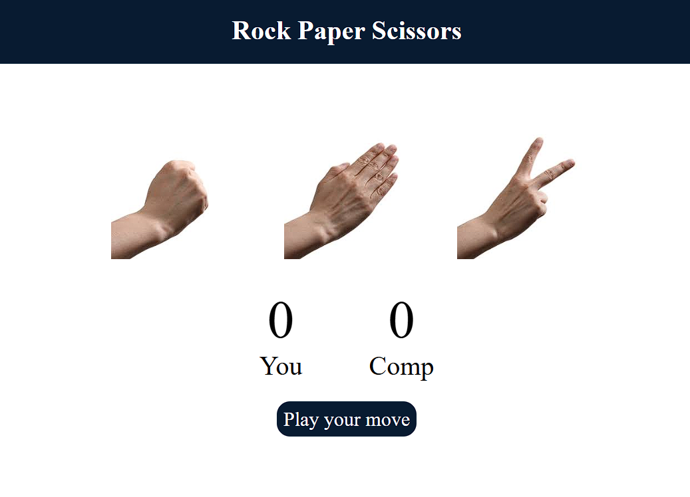

# Rock, Paper, Scissors Game ✊✋✌️

### 🎮 [**PLAY THE GAME LIVE HERE**](https://abubakker07.github.io/rock-paper-scissors-game/)

A classic game of Rock, Paper, Scissors built with vanilla **HTML, CSS, and JavaScript**. This project was created in 2023 as part of my early web development learning journey. It's a simple, interactive game where you can test your luck against the computer.

---

## 📖 About The Project

This project is a fun, browser-based game that demonstrates fundamental web development concepts. The goal was to create a fully functional game using only core technologies, focusing on DOM manipulation, event handling, and basic game logic with JavaScript. It serves as a great example of combining HTML structure, CSS styling, and JavaScript interactivity to create an engaging user experience.

---

## ✨ Features

-   **Interactive Gameplay:** Click on the images to choose your move (Rock, Paper, or Scissors).
-   **Computer Opponent:** The computer randomly selects its move.
-   **Score Tracking:** The game keeps track of your score and the computer's score.
-   **Win/Loss/Draw Logic:** The game determines the winner of each round and updates the score.
-   **Simple & Clean UI:** A minimalist design that is easy to understand and use.

---

## 🛠️ Built With

This project was built using the fundamental building blocks of the web:

* **HTML5**
* **CSS3**
* **JavaScript (ES6)**

---

## 🚀 How to Play

1.  Click the link above to open the game.
2.  Select your weapon: **Rock**, **Paper**, or **Scissors**.
3.  Watch the battle unfold!
4.  Check the scoreboard to see if you can beat the computer.
-   
-   
-   

---
